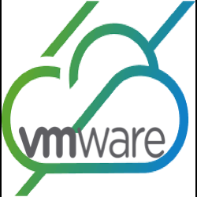

# PowerShell Module for VMware Cloud Services Platform (CSP)

## Summary

PowerShell Module to interact with the [Cloud Services Platform Site](https://console.cloud.vmware.com/csp/gateway/portal/) API. More details can be found in this blog post [here](https://www.williamlam.com/2018/07/automation-with-the-vmware-cloud-services-portal-csp.html).

## Prerequisites
* [PowerCLI 12.0](https://code.vmware.com/web/tool/12.0.0/vmware-powercli) or newer
* VMware Cloud on AWS scoped [Refresh Token](https://docs.vmware.com/en/VMware-Cloud-services/services/Using-VMware-Cloud-Services/GUID-E2A3B1C1-E9AD-4B00-A6B6-88D31FCDDF7C.html)

## Functions

* Get-CSPAccessToken
* Get-CSPServices
* Get-CSPRefreshTokenExpiry